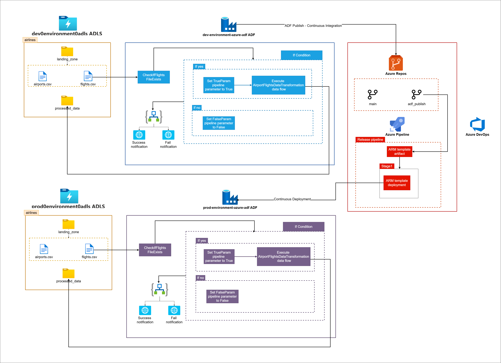
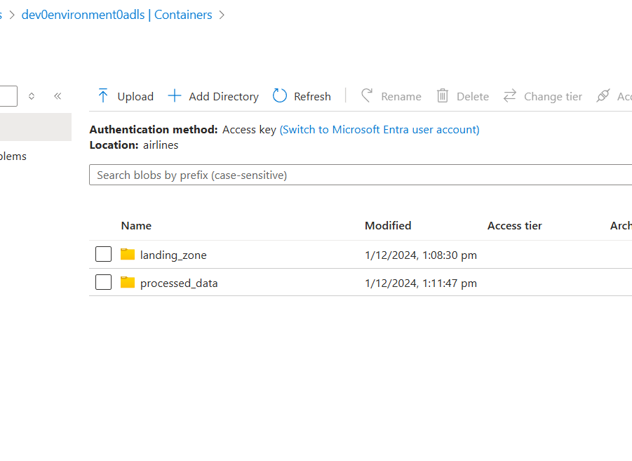
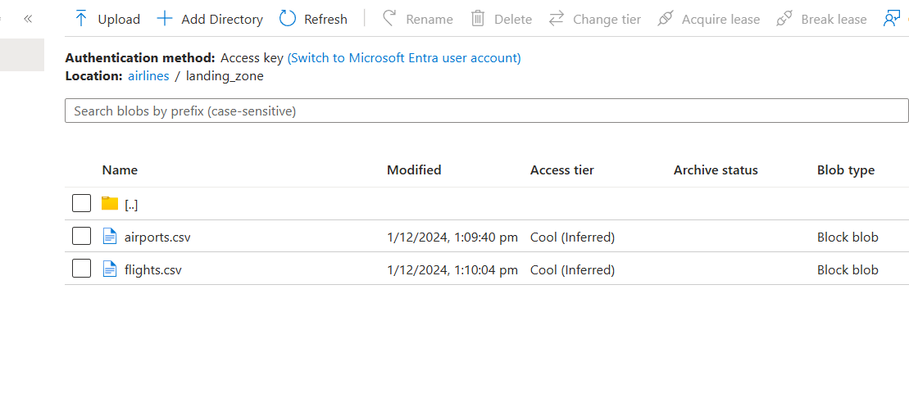
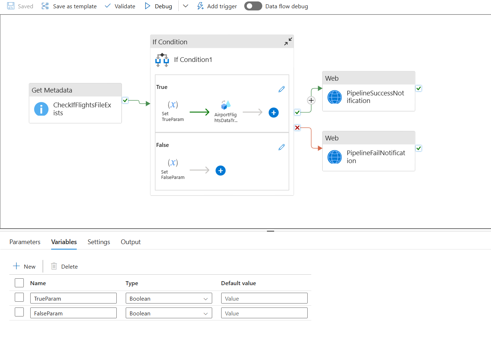
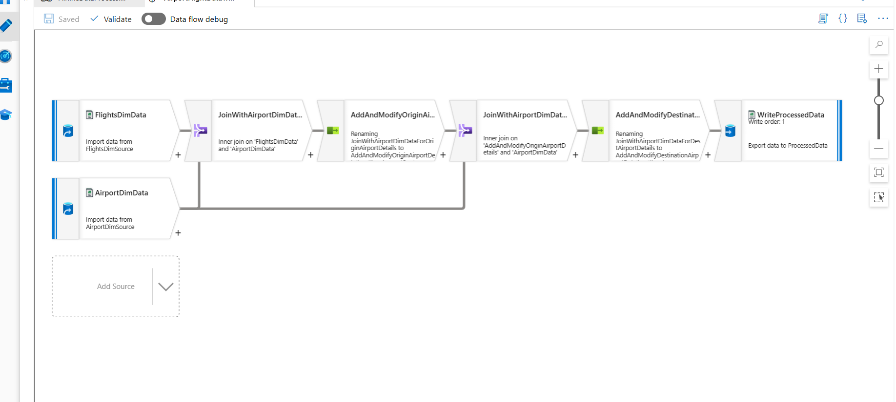
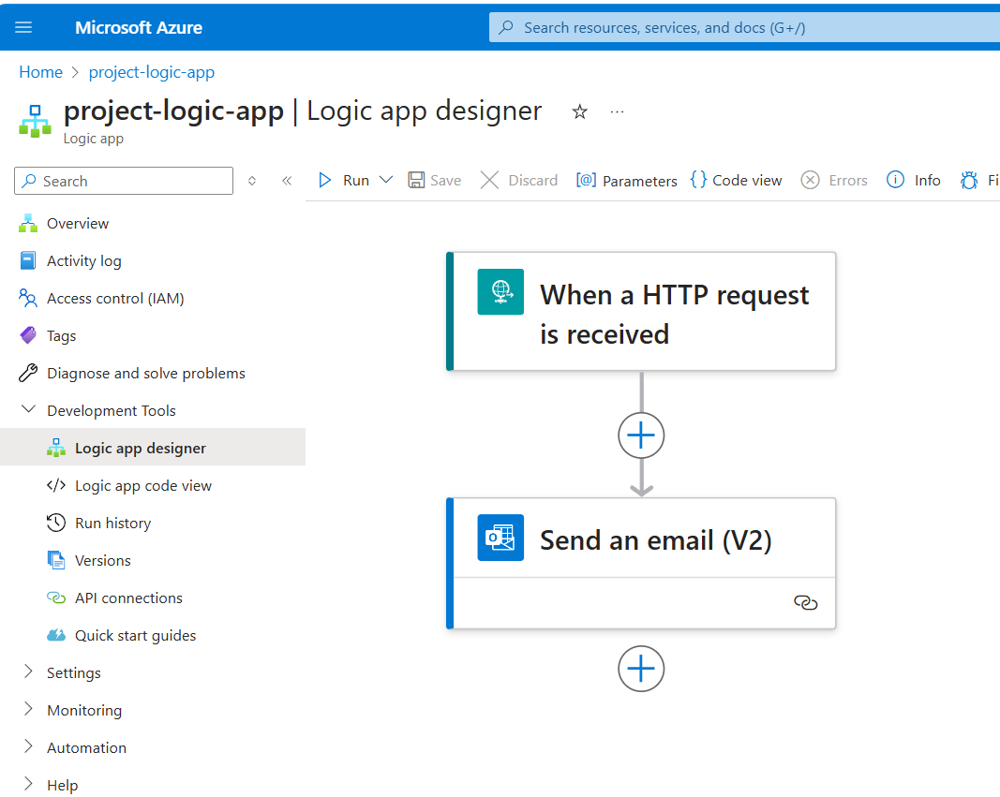
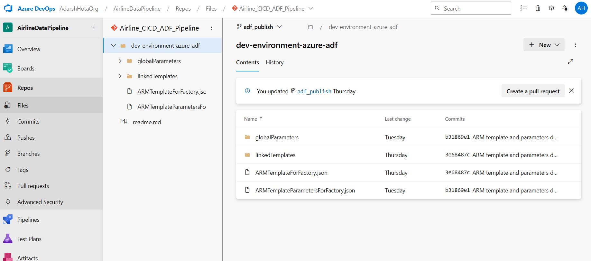
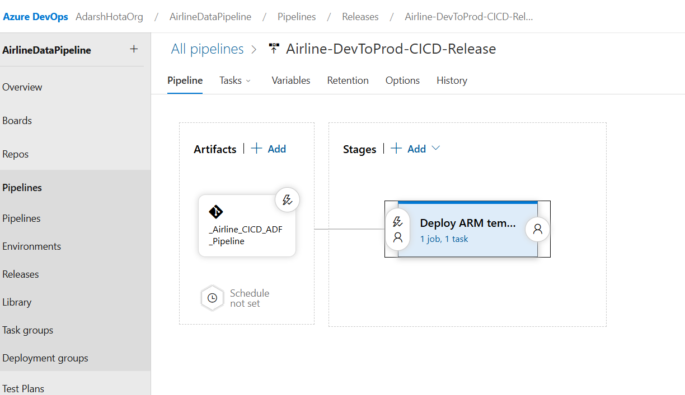
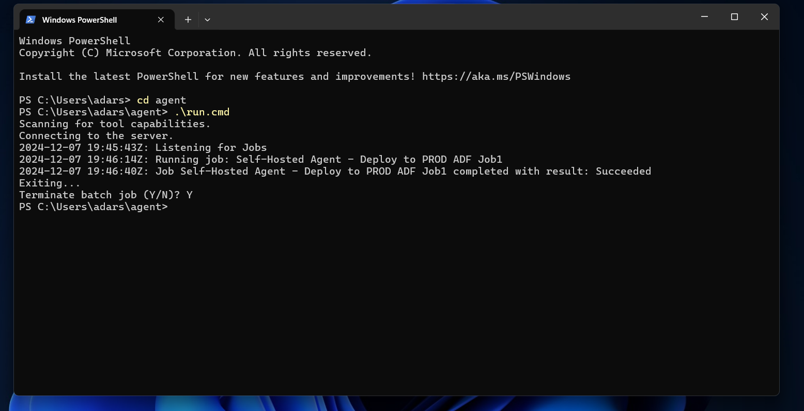

# CI/CD for Azure Data Factory with Azure DevOps

## **Project Overview**

This project focuses on automating the deployment and management of Azure Data Factory (ADF) pipelines using **Azure DevOps**. The goal is to ensure that pipeline configurations are seamlessly deployed from the **development environment** (Dev) to the **production environment** (Prod), leveraging **CI/CD practices**.

### **Pipeline Components:**

- **Dev Environment (ADF Instance)**:
  - The pipeline in the **Dev ADF instance** verifies the existence of data files in ADLS.
  - If the files are found, it triggers the data flow activity for processing flight and airport data.

- **Prod Environment (ADF Instance)**:
  - The pipeline in the **Prod ADF instance** runs identically to the Dev environment pipeline, ensuring that any configuration changes are seamlessly transferred to production.

### **CI/CD Flow:**

- **Continuous Integration (CI)**:
  - Any changes to the pipeline configurations in the Dev environment trigger a build process in Azure DevOps, creating ARM templates.
  
- **Continuous Deployment (CD)**:
  - The release pipeline deploys the ARM templates to the Prod environment, ensuring that the production pipeline is always up to date.

---

### **Tech Stack:**

- **Azure Data Factory (ADF)**
- **Azure DevOps**
- **Azure Repos**
- **Azure Pipeline**
- **ARM Templates**
- **Azure Data Lake Storage (ADLS)**
- **Logic Apps**

---

## **High-Level Architecture**

The architecture of this project involves both **Azure Data Factory** (ADF) and **Azure DevOps**. It is designed to automate the deployment of ADF pipelines using **Continuous Integration (CI)** and **Continuous Deployment (CD)**.

### **Development Workflow (Dev Environment)**

In the development environment, data is stored in **Azure Data Lake Storage (ADLS)**, under the `landing_zone` folder. The ADF pipeline, configured in the Dev ADF instance, handles the **CheckIfFlightsFileExists** activity to ensure the required files exist before proceeding with further transformations.

1. **Source Data**:

    

   The source data resides in the `landing_zone` folder of ADLS 'airlines' container and includes `airports.csv` and `flights.csv`.

   

1. **Pipeline Activities**:

    

- **CheckIfFlightsFileExists**: In both the Dev and Prod environments, this activity checks if the required flight data files exist in **Azure Data Lake Storage (ADLS)** before proceeding with data transformations.

- **If Condition**: This conditional check evaluates whether the flight data files exist. If they do, it sets the `TrueParam` pipeline parameter to true and proceeds with data transformation. If not, it sets the `FalseParam` to false, signaling a failure state.

  - **AirportFlightDataTransformation**: This is the main data transformation activity. It reads data from two sources (flight data and airport data), performs a join, modifies columns, and writes the final processed data to a designated **ProcessedData** sink. The data flow consists of the following steps:

    

    - **Source Datasets**:
      - The data flow begins by reading from two source datasets:
      - `FlightsDimSource`: Contains flight data such as carrier, origin airport ID, destination airport ID, and delays.
      - `AirportDimSource`: Contains airport information such as airport ID, city, state, and airport name.

    - **Transformations**:
      - The transformation flow proceeds with several operations to clean, join, and modify the data:
      - **JoinWithAirportDimDataForOriginAirportDetails**: Joins the flight data with the airport data to get the details of the origin airport (such as airport name, state, and city).
      - **AddAndModifyOriginAirportDetails**: Modifies the columns to include the additional airport details like the origin airport name, state, and city.
      - **JoinWithAirportDimDataForDestAirportDetails**: Joins the flight data with the airport data to get the details of the destination airport.
      - **AddAndModifyDestinationAirportDetails**: Modifies the columns to include the additional airport details for the destination airport.

    - **Sink Dataset**:
      - After the transformations, the data is written to the **ProcessedData** sink. The processed data includes:
      - Carrier, OriginAirportID, DestAirportID, OriginAirportName, OriginState, OriginCity, DestAirportName, DestState, DestCity, DepDelay, ArrDelay.

- **Success/Failure Notifications**: Whether the pipeline succeeds or fails, notifications are sent via Logic Apps to alert stakeholders.

  

### **Continuous Integration (CI) - Azure Data Factory and Azure DevOps**

Azure DevOps is used to manage and automate the deployment of ADF pipeline configurations.

1. **Azure Repos**:
   - The pipeline configurations are stored in **Azure Repos** in the `adf_publish` branch.
   - Any changes made to the pipeline configurations are versioned and tracked in the repository.

2. **Continuous Integration (CI)**:
   - When a developer publishes changes to the dev ADF instance, those changes are synced with the linked Git repository i.e. **ARM templates** are generated and stored in the adf_publish branch.

### **Continuous Deployment (CD) - Azure DevOps**

The release pipeline is responsible for **Continuous Deployment (CD)**, which automates the deployment of pipeline configurations from Dev to Prod.

1. **Release Pipeline**:
   - The **release pipeline** in Azure DevOps takes the ARM templates as input.
   - These templates are deployed to the **Prod environment**, ensuring the production instance of ADF remains up-to-date with the latest configurations.

2. **Environment Sync**:

   

   - The **release pipeline** is executed using a **self-hosted agent job** running on the local machine.

   - The Dev and Prod environments remain synchronized by deploying the configurations from the Dev ADF instance to the Prod instance, ensuring that transformations and data processing flows are consistent across both environments.

---

## **Conclusion**

By integrating Azure Data Factory with Azure DevOps, this project ensures that data processing pipelines are managed and deployed efficiently. The combination of continuous integration and deployment allows the team to work with consistent pipeline configurations across environments, ensuring smooth operations and minimal downtime in production.
